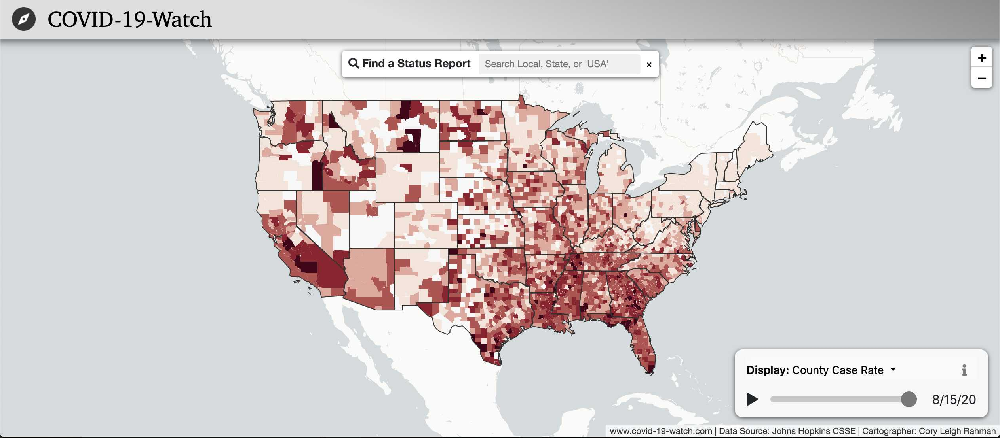
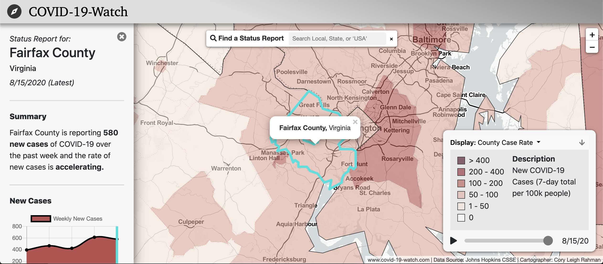
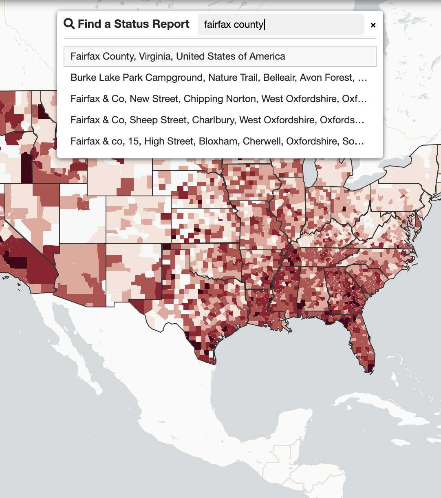
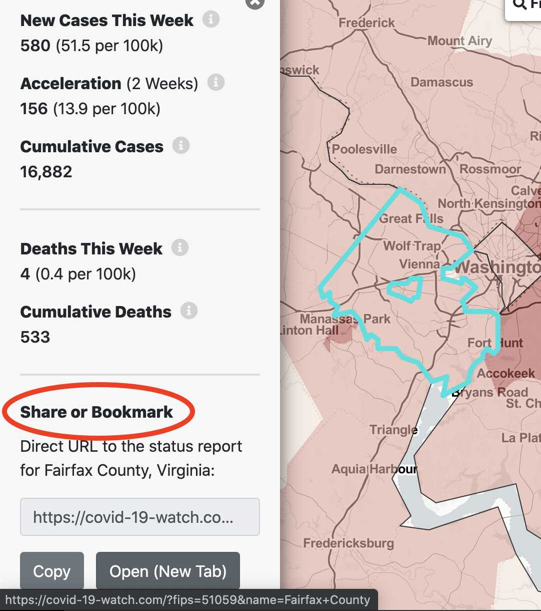
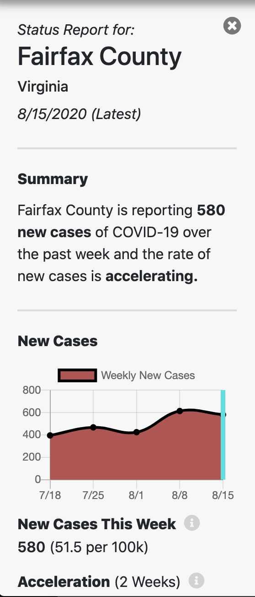
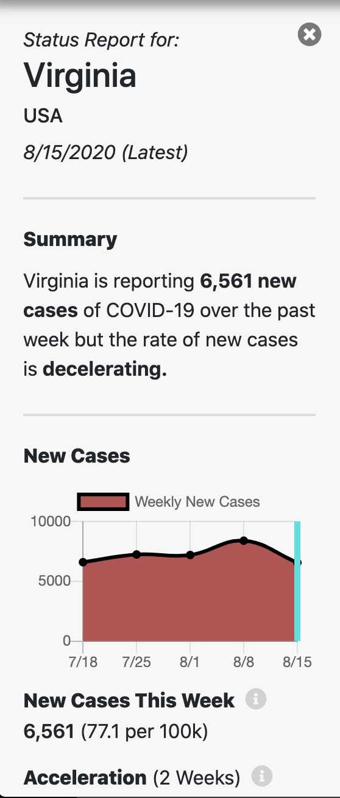
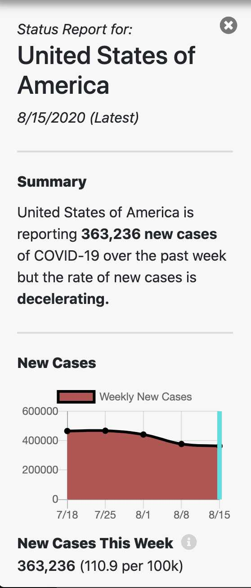
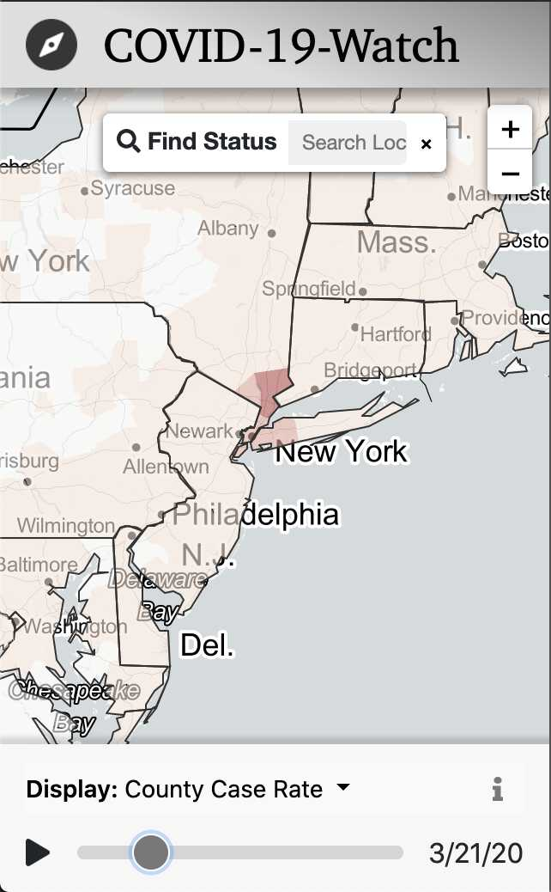
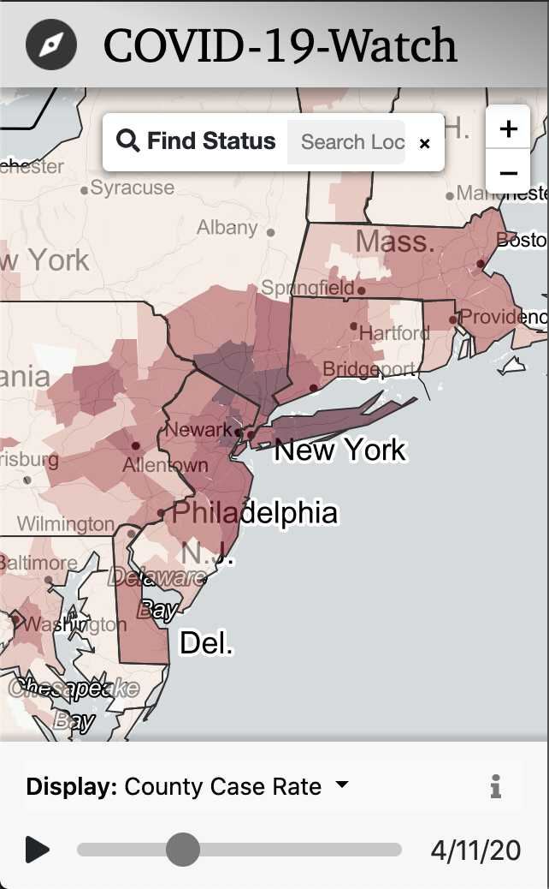

# Executive Summary: COVID-19-Watch

Cory Leigh Rahman • 2020-08-16 • Practicum in GIS Development

Master's in GIS and Web Map Programming, University of Wisconsin-Madison

**Table of Contents**

- [Executive Summary: COVID-19-Watch](#executive-summary-covid-19-watch)
  - [Purpose](#purpose)
  - [Solution](#solution)
    - [How To: Quickly find and share local COVID-19 trends](#how-to-quickly-find-and-share-local-covid-19-trends)
    - [How To: Explore local and national trends](#how-to-explore-local-and-national-trends)
    - [How To: Explore how COVID-19 has progressed over time](#how-to-explore-how-covid-19-has-progressed-over-time)
  - [Understanding the Data](#understanding-the-data)
    - [Data Flow](#data-flow)
  - [Acknowledgements & Technologies Used](#acknowledgements--technologies-used)

## Purpose

This project is meant to encourage our fellow U.S. Citizens to take COVID-19 more seriously by enabling direct access to local, easy-to-understand COVID-19 data.

Many people see a statistic on the national news such as "there have now been 5 million cases in the U.S." and find it hard to personally connect to that number. It is hard to conceptualize. However, when someone sees "*Your County* is reporting 500 new cases of COVID-19 in the past week", that is a lot easier to connect to and comprehend.

## Solution

The ***COVID-19-Watch*** web application (hereafter "COVID-19-Watch") was developed and is available at [www.covid-19-watch.com](https://www.covid-19-watch.com) (and [covid-19-watch.herokuapp.com](http://covid-19-watch.herokuapp.com) for easier access behind firewalls). The app is free and open source; anyone can [view the Source Code on GitHub](https://github.com/CoryLR/COVID-19-Trend-Map).

|  |  |
| ---------------------------------------------------- | ---------------------------------------------------------- |
| COVID-19-Watch Home Screen                           | Local Status Report                                        |

This app allows the public to:

1. Quickly find and share local COVID-19 trends
2. Explore local and national trends
3. Explore how COVID-19 has progressed over time

### How To: Quickly find and share local COVID-19 trends

1. Search for your town or city to get a localized Status Report
2. Send a direct link to any particular Status Report

|  |  |  |
| ----------------------------------------------------------------------- | ----------------------------------------------------------------------------- | ------------------------------------------------------------------------ |
| Search for a Local Status Report                                        | Search for a Local Status Report (cont.)                                      | Share Direct URL to Status Report                                        |

### How To: Explore local and national trends

- Examine the change in colors in the map
- View neighboring State and National Status Reports

|  |  |  |
| ---------------------------------------------------------- | ---------------------------------------------------- | ---------------------------------------------- |
| 51.5 new cases per 100,000 people                          | 77.1 new cases per 100,000 people                    | 110.9 new cases per 100,000 people             |

By comparing population-normalized new cases, we can conclude that in the week leading up to August 16, 2020, both Fairfax County and Virginia were lower than the national average in number of new cases, relative to population.

### How To: Explore how COVID-19 has progressed over time

- Use the time-slider to step back in time, enabling users to view historical COVID-19 data dating back to February 2020
- Use the "play" button to watch change-over-time in the map and the Status Report, if open

|  |  |  |  |
| ------------------------------------------------------- | ------------------------------------------------------- | ------------------------------------------------------ | ------------------------------------------------------- |
| March 21, 2020                                          | March 28, 2020                                          | April 4, 2020                                          | April 11, 2020                                          |

## Understanding the Data

All information is calculated from raw COVID-19 case and death data provided by [Johns Hopkins University Center for Systems Science and Engineering (JHU CSSE)](https://systems.jhu.edu/) (Direct link to the raw data source: [https://github.com/CSSEGISandData/COVID-19](https://github.com/CSSEGISandData/COVID-19)). This Johns Hopkins dataset is highly regarded as one of the best sources of COVID-19 data (Source: [*COVID-19 deaths and cases: how do sources compare?*, Our World in Data](https://ourworldindata.org/covid-sources-comparison)).

### Data Flow

1. Raw COVID-19 data are automatically scraped from Johns Hopkins every morning around 3 a.m. by **Diego the Data Broker**, a web robot developed to support COVID-19-Watch.
2. For every county and state, the nation, and for every week since the data begins, Diego calculates and records the following metrics:
   - Cumulative count of COVID-19 cases (used to calculate other case metrics)
   - Case rate (7-day total of new COVID-19 cases)
   - Case rate, population-normalized (7-day total of new COVID-19 cases per 100,000 people)
   - Acceleration (change in 7-day total of new COVID-19 cases from 2 weeks prior)
   - Acceleration, population-normalized (change in 7-day total of new COVID-19 cases from 2 weeks prior per 100,000 people)
   - Recovery streak (number of weeks since the last reported case of COVID-19)
   - Cumulative count of COVID-19 deaths (used to calculate other deaths metrics)
   - Death rate (7-day total of new COVID-19 deaths)
   - Death rate, population-normalized (7-day total of new COVID-19 deaths per 100,000 people)
   <!-- - Death acceleration (change in 7-day total of new COVID-19 deaths from 2 weeks prior) -->
   <!-- - Death acceleration, normalized (change in 7-day total of new COVID-19 deaths from 2 weeks prior per 100,000 people) -->
3. This data is added to a Data Package alongside county, state, and national GeoJSON map files and added to the database.
4. When a member of the public accesses the app online, Diego takes the morning's latest Data Package and gives it to the app for display in the map and Status Reports.

## Acknowledgements & Technologies Used

- [University of Wisconsin Madison Master's Program in GIS and Web Map Programming](https://geography.wisc.edu/gis/onlinemasters/) for lessons, guidance, and peer reviews for the application
- [Johns Hopkins University Center for Systems Science and Engineering (JHU CSSE)](https://systems.jhu.edu/) for doing the essential job of continuously collecting and publishing COVID-19 data
- [Esri Living Atlas](https://livingatlas.arcgis.com/en/) for population numbers and county, state, and national map data
- [OpenStreetMap](https://www.openstreetmap.org/) for location search capabilities
- [Leaflet](https://leafletjs.com) for web mapping capabilities
- [Angular](https://angular.io) for web framework capabilities
- [Node](https://nodejs.org/) / [Express](https://expressjs.com) for web server capabilities
- [PostgreSQL](https://www.postgresql.org) for database capabilities
- [Heroku](https://www.heroku.com) for development operations and hosting capabilities
